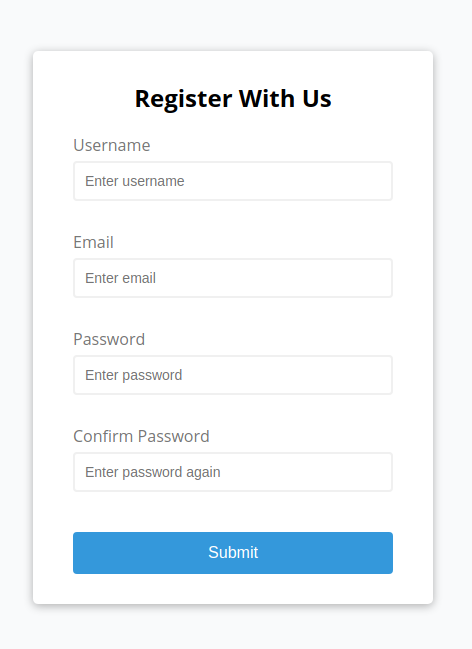
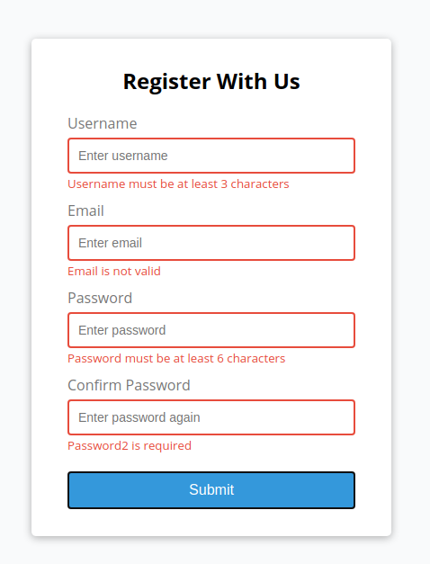
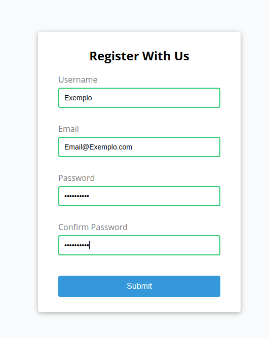

# Login com Validador de Dados

#### Um simples formulário com interação do JavaScript para manipulação da DOM. Com regras para cada campo para criar um login valido.

Tecnologias usadas no projeto:

- JavaScript
- HTML
- CSS

Tela Inicial

Tela de Erro

Tela de Sucesso

###### Como inicializar a aplicação

Basta baixar ou clonar a repositório e abrir o arquivo index.html em um navegador.

